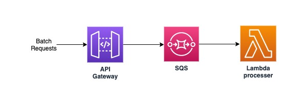

# SQS-Lambda-Batch
Deploy API Gateway, SQS and lambda for batch requests processing

This solution can be used to take the requests in batches/bulk and process them using Lambda. For decouplng the requests and to handle the volume, SQS is being used which will store the API requests as messages and then Lambda will be triggered to read the message from the queue and process it.

Note:
You can modify the Lambda function based on your use case and use boto3 library (if using python) to talk to other AWS services.

#### AWS CloudFormation Link
[CF Template](cloudformation/template.yaml)